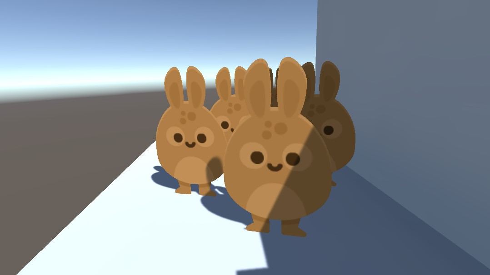

# About Mesh Sprites

A mesh rendering solution for Unity that allows for the use of full lighting on sprites. This is achieved by rendering the sprites via MeshRenderers instead of SpriteRenderers.

Simply add a MeshSprite component to the gameobject you wish to render a sprite on. MeshSprites support most sprite features:
* Multiple sprites per texture
* Any custom sprite pivot
* X and Y flipping
* Per-sprite color

## Requirements

This package requires Unity 2019.4.