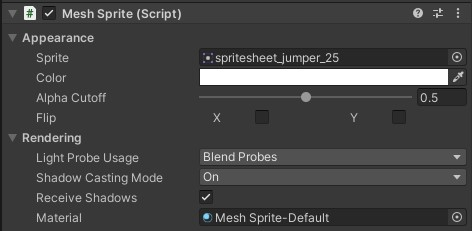

# About Mesh Sprites

A mesh rendering solution for Unity that allows for the use of full lighting on sprites. This is achieved by rendering the sprites via MeshRenderers instead of SpriteRenderers.

Simply add a MeshSprite component to the gameobject you wish to render a sprite on. MeshSprites support most sprite features:
* Multiple sprites per texture
* Any custom sprite pivot
* X and Y flipping
* Per-sprite color

## Usage

Add a `MeshSprite` component to any GameObject that doesn't have any other Renderer on it.

|Property|Description|
|---|---|
|Sprite|The sprite to render. If left blank nothing will render.|
|Color|A tint color applied to the sprite.|
|Alpha Cutoff|The alpha theshold to clip pixels when using an alpha-test material. Does nothing if using a transparent material.|
|Flip|Flip the sprite on either the X or y axis. Note: currently this is not taken into account by the culling bounds, so the sprite may disappear at some angles if it extends too far beyond the default bounds.|
|Light Probe Usage|How light probes are used by the sprite. Identical to its MeshRenderer counterpart.|
|Shadow Casting Mode|How the sprite should cast shadows. Identical to its MeshRenderer counterpart.|
|Receive Shadows|Should shadows be applied to this sprite? Note: this does nothing in deferred rendering, as all meshes are hardcoded to receive shadows.|
|Material|The material to use for rendering.|

In C# code, the sprite can be changed via the `MeshSprite.sprite` property. A tint color may be applied with `MeshSprite.color`. Note: these may be somewhat buggy in edit mode at present. For now it is recommended to update them in play mode only.

## Shaders

The package includes 2 shaders set up to work with mesh sprites by default:

|Material|Shader|Description|
|---|---|---|
|Mesh Sprite-Default|Sprites/Mesh Sprite|Alpha-tested sprite. Normal transparency will not work, but the lighting on the sprite will be full quality. Use Alpha Cutoff on the MeshSprite to adjust the alpha tes threshold.
|Mesh Sprite-Transparent|Sprites/Mesh Sprite (Transparent)| Fully transparent sprite, more like Unity's builtin sprites. The alpha channel will work but the sprite will not be able to receive shadows (this is a Unity limitation).

It's possible to use different materials than the included defaults by assigning a different one in the component's Material field.

Custom shaders can also be used. Mesh sprites are fully able to use surface shaders or normal shaders. Note that flipping will not work in custom shaders by default unless the `_Flip` property is properly implemented in them. Consult the included shaders to see how to implement that.

## Limitations

Currently, sprite meshes may disappear when duplicated in the editor. As a workaround, right click the header of the MeshComponent inspector and select Regenerate to rebuild the mesh manually.

## Requirements

This package requires Unity 2019.4.